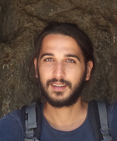

    <small>they/he</small>
     
    <small><i class="fas fa-envelope fa-2x"></i> shlomi &lt;AT&gt; bu &lt;DOT&gt; edu</small>
     
    <small><a href="https://bsky.app/profile/hodthoughts.bsky.social"><i class="fab fa-bluesky fa-2x"></i></a></small>
    <small><a href="https://twitter.com/hodthoughts"><i class="fab fa-twitter fa-2x"></i></a></small>
     
    <a href="https://www.semanticscholar.org/author/1557572573"><i class="ai ai-semantic-scholar-square ai-2x"></i></a>
    <a href="https://scholar.google.com/citations?user=s_WPt74AAAAJ"><i class="ai ai-google-scholar-square ai-2x"></i></a>
    <a href="https://www.linkedin.com/in/shlomi-hod/"><i class="fab fa-linkedin fa-2x"></i></a>
	<!-- <a href="https://drive.google.com/file/d/1e43VAHjGMvHotb0iAwne4PmA2y9db-bK/view?usp=sharing">CV</a> -->
    <a href="https://github.com/shlomihod"><i class="fab fa-github fa-2x"></i></a>
     
    <small><a href="https://calendly.com/shlomi-hod/office-hours">Book Office Hours</a></small>
     
    <small><a href="https://www.admonymous.co/shlomi">(Anonymous) feedback welcome</a></small>

 

I'm a senior researcher at the [German Institute of Employment Research (IAB)](https://iab.de/en/home-2/) and an associate researcher at [Weizenbaum Institute](https://www.weizenbaum-institut.de/en/). I recently completed my CS Ph.D. at Boston University, under the supervision of Prof. Ran Canetti.

I'm working on **deployable responsible computing**. My current research interests include:

1. Technical tools for AI governance
2. Toolbox of differential privacy for real-world deployment 
3. Supporting evidence-based AI policymaking

In February 2024, together with the Israeli Ministry of Health, we released a [differentially private synthetic dataset](https://birth.dataset.pub) of the National Live Birth Registry.

For the last few years, I have taught courses in [Responsible AI, Law, Ethics & Society](https://learn.responsibly.ai/) at various institutions including Boston University, UC Berkeley, Cornell Tech, Bocconi University, Tel Aviv University and the Technion. Our materials are available for faculty [here](https://teach.responsibly.ai/). In August 2023, I taught a two-day [congressional](https://www.bu.edu/hic/2023/08/30/shlomi-hod-leads-congressional-workshop-on-responsible-ai/) [workshop](https://gov.responsibly.ai/23-congress/) for US Congress staffers based on our course.

During the summer of 2024, I was an [OpenDP](https://opendp.org) fellow at Harvard University. Between September 2023 and August 2024, I visited Columbia University to collaborate with Prof. Rachel Cummings. In the summer of 2022, I interned at Twitter Cortex where I leveraged human-in-the-loop research to improve toxicity models. In 2020-2021, I was an Associated Researcher at the [Alexander von Humboldt Institute for Internet and Society (HIIG)](https://www.hiig.de/en/) in Berlin. In the summer of 2019, I did a research internship at the [Center for Human-Compatible AI](https://humancompatible.ai/) at UC Berkeley, working on neural network interpretability. 

In my previous life, I was a social entrepreneur - co-founder of the [Israeli Cyber Education Center](https://cyber.org.il/about-us-eng/). There, I led the development of nationwide educational programs in computing for kids and teens. The center aims to increase social mobility of underrepresented groups in tech, such as women, minorities, and individuals from the suburbs of Israel. I co-authored a [Computer Network textbook](https://data.cyber.org.il/networks/networks.pdf) with a tutorial approach (in Hebrew). 
Before that, I was an algorithmic research team leader in cybersecurity.

## Publications

**SH***, Lucas Rosenblatt*, Julia Stoyanovich. "[Do You Really Need Public Data? Surrogate Public Data for Differential Privacy on Tabular Data](https://arxiv.org/abs/2504.14368)". In *Proceedings of Annual Conference on Neural Information Processing Systems* - Datasets and Benchmarks Track (NeurIPS 2025); and *ICML 2025 Workshop on Foundation Models for Structured Data*, with a spotlight talk (FMSD 2025). 

**SH**, Ran Canetti. "[Differentially Private Release of Israel's National Registry of Live Births](https://arxiv.org/abs/2405.00267)". In IEEE Symposium on Security and Privacy - IEEE S&P (2025).

Rachel Cummings, **SH**, Jayshree Sarathy, Marika Swanberg. "[Attaxonomy: Unpacking Differential Privacy Guarantees Against Practical Adversaries](https://arxiv.org/abs/2405.01716)". EuroS&P 2024 International Workshop on Privacy Engineering (IWPE 2024); and Symposium on Foundations of Responsible Computing (FORC 2024).

**SH**, Karni Chagal-Feferkorn, Niva Elkin-Koren and Avigdor Gal. ["Data Science Meets Law: Learning Responsible AI Together"](https://cacm.acm.org/magazines/2022/2/258224-data-science-meets-law/fulltext/). Communications of the ACM (2022). Featured on the journal cover.

\*Gavin Brown, **\*SH**, \*Iden Kalemaj. ["Performative Prediction in a Stateful World"](https://arxiv.org/abs/2011.03885). International Conference on Artificial Intelligence and Statistics - AISTATS (2022). Preliminary version at NeurIPS Workshop on Consequential Decision Making in Dynamic Environments, with contributed talk (2020).

\*Stephen Casper, **\*SH**, \*Daniel Filan, Cody Wild, Andrew Critch and Stuart Russell. "[Graphical Clusterability and Local Specialization in Deep Neural Networks](https://openreview.net/pdf?id=HreeeJvkue9)". ICLR PAIR2Struct Workshop (2022).

**\*SH**, \*Stephen Casper, \*Daniel Filan, Cody Wild, Andrew Critch and Stuart Russell. ["Detecting Modularity in Deep Neural Networks"](https://arxiv.org/abs/2110.08058). Preprint (2021).

\*Daniel Filan, \*Stephen Casper, **\*SH**, Cody Wild, Andrew Critch, and Stuart Russell. ["Clusterability in Neural Networks"](https://arxiv.org/abs/2103.03386). Preprint (2021).
