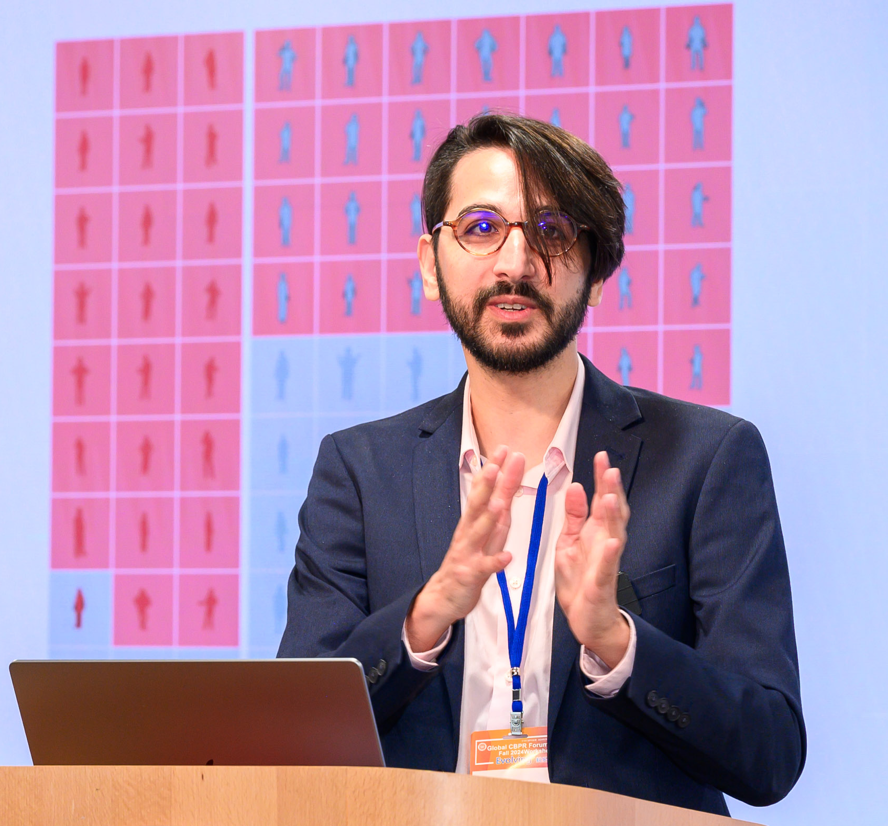

    <small>he/they</small>
     
    <i class="fas fa-envelope fa-2x"></i> shlomi &lt;AT&gt; bu &lt;DOT&gt; edu
     
    <a href="https://twitter.com/hodthoughts"><i class="fab fa-twitter fa-2x"></i>@hodthoughts</a>
     
    <a href="https://www.semanticscholar.org/author/1557572573"><i class="ai ai-semantic-scholar-square ai-2x"></i></a>
    <a href="https://scholar.google.com/citations?user=s_WPt74AAAAJ"><i class="ai ai-google-scholar-square ai-2x"></i></a>
    <a href="https://www.linkedin.com/in/shlomi-hod/"><i class="fab fa-linkedin fa-2x"></i></a>
	<a href="https://docs.google.com/document/d/1Sh9yne7wuqaQpLoPifx_fk_nhhr0KmFcGegWU4bdtII/edit?usp=sharing
">CV</a>
    <a href="https://github.com/shlomihod"><i class="fab fa-github fa-2x"></i></a>
     
    <small><a href="https://go.hod.xyz/office-hour">Book Office Hours</a></small>
     
    <small><a href="https://www.admonymous.co/shlomi">(Anonymous) feedback welcome</a></small>

 

**During the 2023-2024 academic year, I'll be visiting Columbia University to work with Prof. [Rachel Cummings](https://rachelcummings.com).**

I'm a CS Ph.D. candidate at Boston University, being supervised by [Prof. Ran Canetti](http://www.bu.edu/cs/profiles/ran-canetti/).

I'm interested in **Responsible AI**, particularly:
1. Differentially private synthetic data for government data
1. The interaction between Computer Science and the Law
1. Interpretable machine learning

For the last years, I teach courses in [Responsible AI, Law, Ethics & Society](https://learn.responsibly.ai/) in various institutes including Boston University, Cornell Tech, Bocconi University, Tel Aviv University and the Technion. Our materials are available for faculty [here](https://teach.responsibly.ai/). In August 2023, I taught a two-day [congressional workshop](https://gov.responsibly.ai) for US Congress staffers based on our course.

In summer 2022, I interened at Twitter Cortex where I leverged human-in-the-loop research to improve toxicity models. In 2020-2021, I was an Associated Researcher at the [Alexander von Humboldt Institute for Internet and Society (HIIG)](https://www.hiig.de/en/) in Berlin. In summer 2019, I did a research internship at the [Center for Human-Compatible AI](https://humancompatible.ai/) at UC Berkeley, working on neural network interpretability. 

In my previous life, I was a social entrepreneur - co-founder of the [Israeli Cyber Education Center](https://cyber.org.il/about-us-eng/). There I led the development of nationwide educational programs in computing for kids and teens. The center aims to increase the social mobility of underrepresented groups in tech, such as women, minorities, and individuals from the suburbs of Israel. I co-authored a [Computer Network textbook](https://data.cyber.org.il/networks/networks.pdf) in a tutorial approach (in Hebrew). 
Before that, I was an algorithmic research team leader in cybersecurity.

## Publications

**Shlomi Hod**, Karni Chagal-Feferkorn, Niva Elkin-Koren and Avigdor Gal. ["Data Science Meets Law: Learning Responsible AI Together"](https://cacm.acm.org/magazines/2022/2/258224-data-science-meets-law/fulltext/). Communications of the ACM (2022). Featured on the journal cover.

\*Gavin Brown, **\*Shlomi Hod**, \*Iden Kalemaj. ["Performative Prediction in a Stateful World"](https://arxiv.org/abs/2011.03885). International Conference on Artificial Intelligence and Statistics - AISTATS (2022). Preliminary version at NeurIPS Workshop on Consequential Decision Making in Dynamic Environments, with contributed talk  (2020).

**\*Shlomi Hod**, \*Stephen Casper, \*Daniel Filan, Cody Wild, Andrew Critch and Stuart Russell. ["Detecting Modularity in Deep Neural Networks"](https://arxiv.org/abs/2110.08058). arXiv preprint arXiv:2110.08058 (2021).

\*Daniel Filan, \*Stephen Casper, **\*Shlomi Hod**, Cody Wild, Andrew Critch, and Stuart Russell. ["Clusterability in Neural Networks"](https://arxiv.org/abs/2103.03386). arXiv preprint arXiv:2103.03386 (2021).

\*Daniel Filan, **\*Shlomi Hod**, Cody Wild, Andrew Critch, and Stuart Russell. ["Neural Networks are Surprisingly Modular"](https://arxiv.org/abs/2003.04881). arXiv preprint arXiv:2003.04881 (2020).

